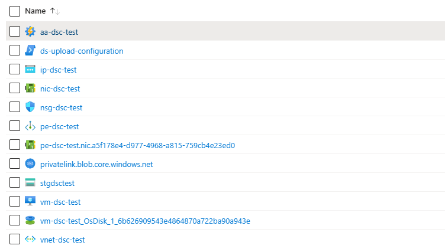
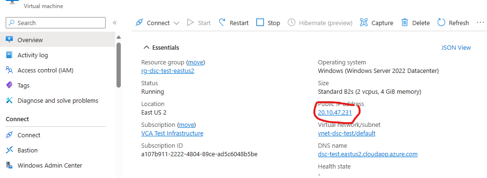
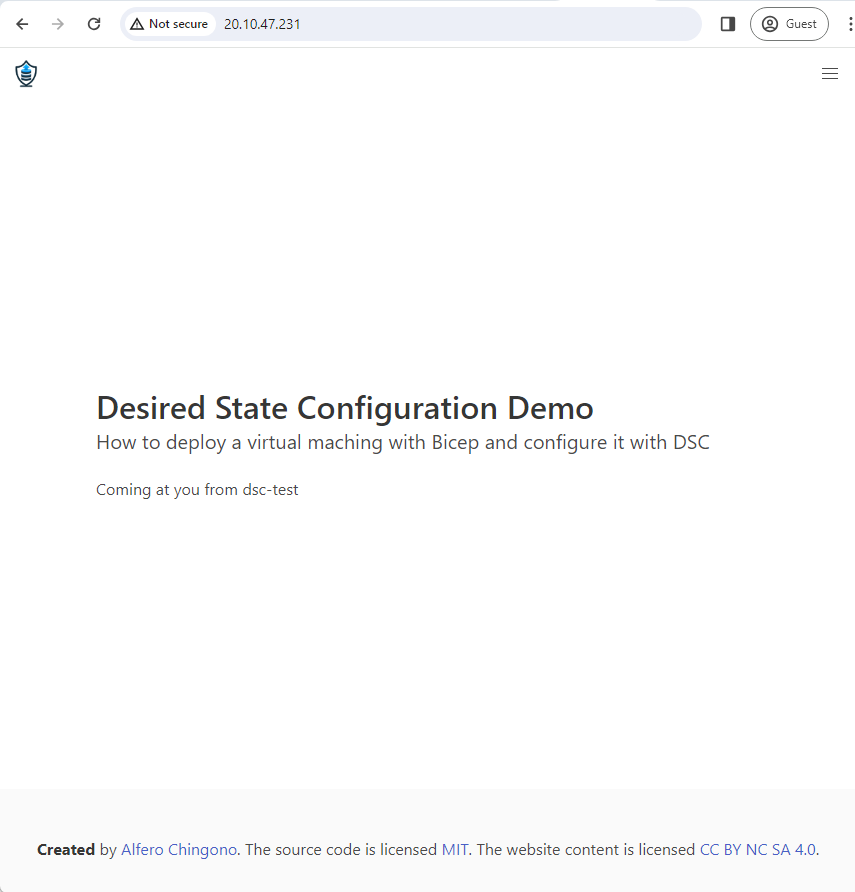
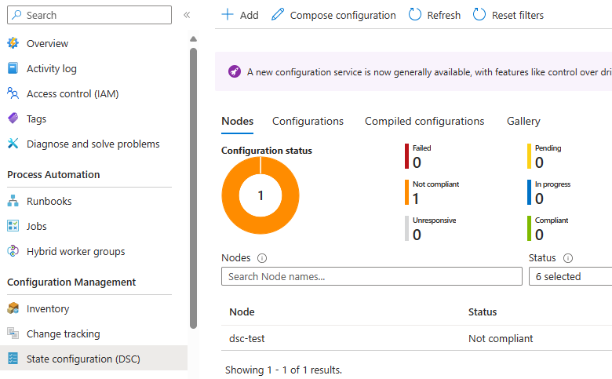

# POC: Azure Virtual Machines provisioning through Azure Automation State Configuration

This repository demonstrates a sample IIS application running in an [Azure Virtual Machine](https://azure.microsoft.com/en-us/products/virtual-machines/), deployed through [Azure Automation State Configuration](https://learn.microsoft.com/en-us/azure/automation/automation-dsc-overview)

## Features

[Azure Automation State Configuration](https://learn.microsoft.com/en-us/azure/automation/automation-dsc-overview) is an Azure configuration management service that allows you to write, manage, and compile PowerShell Desired State Configuration (DSC) [configurations](https://learn.microsoft.com/en-us/powershell/dsc/configurations/configurations) for nodes in any cloud or on-premises datacenter. The service also imports [DSC Resources](https://learn.microsoft.com/en-us/powershell/dsc/resources/resources), and assigns configurations to target nodes, all in the cloud.

## Architecture

- **[Azure Resource Groups](https://learn.microsoft.com/azure/azure-resource-manager/management/manage-resource-groups-portal)** are logical containers for Azure resources. You use a single resource group to structure everything related to this solution in the Azure portal.

- **[Azure Virtual Machines](https://azure.microsoft.com/en-us/products/virtual-machines/)** is an on-demand, scalable cloud computing Azure service with allocation of hardware, including CPU cores, memory, hard drives, network interfaces, and other devices to run a wide range of operating systems, applications, and workloads in the Azure cloud environment.

- **[Azure Virtual Network](https://azure.microsoft.com/en-us/products/virtual-network/)** is a service that provides the fundamental building block for your private network in Azure. An instance of the service (a virtual network) enables many types of Azure resources to securely communicate with each other, the internet, and on-premises networks.

- **[Azure Private Link](https://azure.microsoft.com/en-us/products/private-link/)** enables access to Azure PaaS Services (for example, SQL Database) over a private endpoint in the virtual network.

- **[Azure Storage Account](https://learn.microsoft.com/en-us/azure/storage/common/storage-account-overview)** is a fundamental component in Microsoft Azure’s cloud ecosystem. It provides a scalable and secure solution for storing various data types.

- **[Azure Automation Account](https://learn.microsoft.com/en-us/azure/automation/overview)** is a service in Azure that provides a way to automate the creation, deployment, monitoring, and maintenance of resources in your Azure environment. It allows you to centrally manage and automate tasks across Azure resources, on-premises resources, and other cloud platforms.

## Additional Technologies

- **[Bicep](https://learn.microsoft.com/en-us/azure/azure-resource-manager/bicep/overview)** is a domain-specific language (DSL) that uses declarative syntax to deploy Azure resources. In a Bicep file, you define the infrastructure you want to deploy to Azure, and then use that file throughout the development lifecycle to repeatedly deploy your infrastructure. Your resources are deployed in a consistent manner. Bicep provides concise syntax, reliable type safety, and support for code reuse. Bicep offers a first-class authoring experience for your [infrastructure-as-code](https://learn.microsoft.com/en-us/devops/deliver/what-is-infrastructure-as-code) solutions in Azure.

- **[PowerShell Desired State Configuration](https://learn.microsoft.com/en-us/powershell/dsc/overview)** is a configuration management platform built into Windows that is based on open standards. DSC is flexible enough to function reliably and consistently in each stage of the deployment lifecycle (development, test, pre-production, production), and during scale-out.

- **[Web Deploy](https://www.iis.net/downloads/microsoft/web-deploy)** an IIS extension that simplifies deployment of Web applications and Web sites to IIS servers. Web Deploy enables packaging Web application content, configuration, databases and any other artifacts like registry, GAC assemblies etc., which can be used for storage or redeployment.

## Getting Started

The deployment process involves the following steps:
1. Provision the architecture using Bicep
1. Create application deployment package
1. Publish application deployment package

### Prerequisites

1. Local bash shell with Azure CLI or [Azure Cloud Shell](https://ms.portal.azure.com/#cloudshell/)
1. Azure Subscription. [Create one for free](https://azure.microsoft.com/free/).
1. Clone or fork of this repository.

### QuickStart

A bash script is included for quickly provisioning a fully functional environment in Azure. The script requires the following parameters:

```
-n: The deployment name.
-l: The region where resources will be deployed.
-c: A unique string that will ensure all resources provisioned are globally unique.
-u: The virtual machine administrator username
-p: The virtual machine administrator password
```
> **NOTE:** Please refer to the [Resource Name Rules](https://learn.microsoft.com/azure/azure-resource-manager/management/resource-name-rules#microsoftweb) to learn more about globally unique resources.

Follow the steps below to quickly deploy using the bash script:

1. Clone the repository to local machine.
    ```
    git clone https://github.com/achingono/poc-vm-dsc-automation.git
    ```
1. Switch to the cloned folder
    ```
    cd poc-vm-dsc-automation
    ```

1. Make the bash script executable
    ```
    chmod +x ./deploy.sh
    ```

1. Login to Azure and ensure the correct subscription is selected
    ```
    az login
    az account set --subscription <subscription id>
    az account show
    ```

1. Run the script and provide required parameters
    ```
    ./deploy.sh -n autoconfig -l eastus2 -c poc -u azureuser -p <secure password>
    ```
    In the above command, `autoconfig` is the name of the environment, and `poc` is the variant. This generates a resource group named `rg-autoconfig-poc-eastus2`.

## Verifying Deployment

When the deployment completes:

1. Navigate to the resource group in the Azure Portal. You should see a list of resources that looks something like this:

    

1. Click on the `Virtual Machine`. Copy the public IP address:

    

1. Navigate to the public IP address in your browser:

    

1. Click on the automation account. Select the `State Configuration (DSC)` tab on the left-hand side:

    


## Cleanup

Clean up the deployment by deleting the single resource group that contains the entire infrastructure.

> **WARNING:** This will delete ALL the resources inside the resource group.

1. Make the bash script executable
    ```
    chmod +x ./destroy.sh
    ```

2. Login to Azure and ensure the correct subscription is selected
    ```
    az login
    az account set --subscription <subscription id>
    az account show
    ```

3. Run the script and provide required parameters
    ```
    ./destroy.sh -n autoconfig -l eastus2 -c poc
    ```